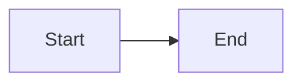

# armoire Viewer Implementation Plan (Phase 1)

> **For agentic workers:** REQUIRED SUB-SKILL: Use superpowers:subagent-driven-development (recommended) or superpowers:executing-plans to implement this plan task-by-task. Steps use checkbox (`- [ ]`) syntax for tracking.

**Goal:** Serve any local folder as a read-only website that renders markdown (with math and diagrams), PDFs, notebooks, code, and parquet/CSV tables.

**Architecture:** A FastAPI server reads the target folder directly off disk and exposes four JSON/bytes endpoints. A no-build-step ES-module frontend consumes them: a lazy tree that fetches one directory level per expand, a fuzzy filter over a flat path index, and five renderers dispatched on file extension. Every filesystem access routes through a single path-jail module.

**Tech Stack:** Python 3.11+, FastAPI, uvicorn, polars, nbformat, nbconvert, click. Frontend is plain ES modules with marked, KaTeX, mermaid, and highlight.js vendored locally. Tests are pytest. Tooling is uv and ruff.

**Spec:** `docs/superpowers/specs/2026-08-01-armoire-design.md`

## Global Constraints

- Python 3.11 floor. CI matrix is 3.11, 3.12, 3.13 on ubuntu-latest and windows-latest.
- `pathlib` throughout. No shell-outs, no `os.system`, no platform-specific path strings.
- The server binds `127.0.0.1` only. Never `0.0.0.0`.
- `serve` never writes to disk. Any test that starts the server asserts the tree is unmodified.
- No CDN. Every frontend library is a local file under `src/armoire/static/vendor/`.
- No build step. The frontend is ES modules loaded directly by the browser.
- No request may walk the full tree. Directory listing is one level; the flat index is built once at startup.
- Default ignores, exactly: `.git`, `.venv`, `node_modules`, `__pycache__`, `site-packages`, `.ruff_cache`, `.pytest_cache`.
- Colors, verbatim: background `#ffffff`, text `#1f2328`, link `#0969da`, border `#d1d9e0`, subtle fill `#f6f8fa`. Radius 6px.
- Package name and CLI are both `armoire`. Static assets ship inside the package at `src/armoire/static/`, vendored libraries included — the wheel must be self-contained or `uvx armoire serve` is broken on install.
- Frontend behaviour is verified by Playwright against a live server, never by asserting on JavaScript source text.

## Deviation from the spec

The spec calls for the flat index to be disk-cached and invalidated by root mtime.
This plan builds it in a background thread at startup with **no disk cache**. Root
mtime only changes when direct children change, so it cannot detect edits deep in
the tree — the cache would serve stale paths. Task 3 includes a timing step against
a real 12 GB folder; if the build exceeds 5 seconds, revisit caching with evidence.

## File Structure

| File | Responsibility |
|---|---|
| `pyproject.toml` | Package metadata, deps, ruff and pytest config |
| `.github/workflows/ci.yml` | ruff + pytest matrix |
| `src/armoire/paths.py` | Resolve a request path against root; reject escapes |
| `src/armoire/ignore.py` | Which names are never shown |
| `src/armoire/scanner.py` | One directory → listing |
| `src/armoire/index.py` | Flat path list for the filter |
| `src/armoire/previews/__init__.py` | Extension → preview kind dispatch |
| `src/armoire/previews/text.py` | markdown/code/plain text |
| `src/armoire/previews/table.py` | parquet/CSV via lazy polars |
| `src/armoire/previews/notebook.py` | `.ipynb` → HTML |
| `src/armoire/app.py` | FastAPI routes |
| `src/armoire/cli.py` | `armoire serve` |
| `scripts/vendor.py` | Fetch frontend libraries once |
| `src/armoire/static/index.html` | Page shell |
| `src/armoire/static/app.css` | Design tokens and layout |
| `src/armoire/static/app.js` | Router, wires modules together |
| `src/armoire/static/tree.js` | Lazy directory tree |
| `src/armoire/static/filter.js` | Fuzzy filter over the flat index |
| `src/armoire/static/preview.js` | Dispatch on `kind` |
| `src/armoire/static/format.js` | Size and age formatting, shared by listing and status bar |
| `src/armoire/static/renderers/*.js` | markdown, code, pdf, table, notebook, listing |

---

### Task 1: Project scaffolding and the path jail

Everything else depends on `resolve_in_root`. It ships first, with CI, so the
repo is green from the first commit.

**Files:**
- Create: `pyproject.toml`, `.github/workflows/ci.yml`, `src/armoire/__init__.py`, `src/armoire/paths.py`
- Test: `tests/test_paths.py`

**Interfaces:**
- Consumes: nothing
- Produces: `armoire.paths.resolve_in_root(root: Path, relative: str) -> Path` and `armoire.paths.PathOutsideRoot(Exception)`

- [ ] **Step 1: Create `pyproject.toml`**

```toml
[project]
name = "armoire"
version = "0.1.0"
description = "Serve any folder as a local, read-only website."
readme = "README.md"
license = { file = "LICENSE" }
requires-python = ">=3.11"
dependencies = [
    "fastapi>=0.115",
    "uvicorn>=0.32",
    "click>=8.1",
    "polars>=1.0",
    "nbformat>=5.10",
    "nbconvert>=7.16",
]

[project.scripts]
armoire = "armoire.cli:main"

[project.urls]
Homepage = "https://github.com/dafu-zhu/armoire"

[dependency-groups]
dev = ["pytest>=8.0", "httpx>=0.27", "ruff>=0.6", "pytest-playwright>=0.5"]

[build-system]
requires = ["hatchling"]
build-backend = "hatchling.build"

[tool.hatch.build.targets.wheel]
packages = ["src/armoire"]

[tool.ruff]
line-length = 100
src = ["src", "tests"]
# Plans and specs contain illustrative Python fences. Ruff formats fenced code
# inside markdown, and reformatting them would desynchronise the task briefs
# extracted from those documents.
exclude = ["docs"]

[tool.ruff.lint]
select = ["E", "F", "I", "UP", "B"]

[tool.pytest.ini_options]
testpaths = ["tests"]
```

- [ ] **Step 2: Create the package marker**

Create `src/armoire/__init__.py`:

```python
__version__ = "0.1.0"
```

- [ ] **Step 3: Write the failing test**

Create `tests/test_paths.py`:

```python
import sys

import pytest

from armoire.paths import PathOutsideRoot, resolve_in_root


@pytest.fixture
def root(tmp_path):
    (tmp_path / "docs").mkdir()
    (tmp_path / "docs" / "readme.md").write_text("hi")
    (tmp_path / "outside.txt").write_text("secret")
    inner = tmp_path / "docs"
    return inner


def test_resolves_a_child(root):
    assert resolve_in_root(root, "readme.md") == (root / "readme.md").resolve()


def test_empty_path_is_the_root_itself(root):
    assert resolve_in_root(root, "") == root.resolve()


def test_rejects_dotdot_escape(root):
    with pytest.raises(PathOutsideRoot):
        resolve_in_root(root, "../outside.txt")


def test_rejects_nested_dotdot_escape(root):
    with pytest.raises(PathOutsideRoot):
        resolve_in_root(root, "a/b/../../../outside.txt")


def test_rejects_absolute_path(root):
    absolute = "C:/Windows/win.ini" if sys.platform == "win32" else "/etc/passwd"
    with pytest.raises(PathOutsideRoot):
        resolve_in_root(root, absolute)


def test_rejects_null_byte(root):
    with pytest.raises(PathOutsideRoot):
        resolve_in_root(root, "readme.md\x00.png")


@pytest.mark.skipif(sys.platform == "win32", reason="symlink creation needs admin on Windows")
def test_rejects_symlink_pointing_outside(root, tmp_path):
    (root / "escape").symlink_to(tmp_path / "outside.txt")
    with pytest.raises(PathOutsideRoot):
        resolve_in_root(root, "escape")
```

- [ ] **Step 4: Run the test to verify it fails**

Run: `uv run pytest tests/test_paths.py -v`
Expected: FAIL — `ModuleNotFoundError: No module named 'armoire.paths'`

- [ ] **Step 5: Write the implementation**

Create `src/armoire/paths.py`:

```python
"""The single gate for turning a request path into a filesystem path.

Every filesystem access in armoire goes through resolve_in_root. The server
streams arbitrary bytes from the root, so an escape here is the whole security
boundary failing.
"""

from pathlib import Path


class PathOutsideRoot(Exception):
    """A request path resolved to somewhere outside the served root."""


def resolve_in_root(root: Path, relative: str) -> Path:
    """Resolve `relative` against `root`, refusing anything that escapes it.

    Resolution follows symlinks, so a symlink inside the root that points
    outside it is refused just like a `..` traversal.
    """
    if "\x00" in relative:
        raise PathOutsideRoot(relative)

    resolved_root = root.resolve()
    candidate = (resolved_root / relative).resolve()

    if not candidate.is_relative_to(resolved_root):
        raise PathOutsideRoot(relative)

    return candidate
```

- [ ] **Step 6: Run the test to verify it passes**

Run: `uv run pytest tests/test_paths.py -v`
Expected: PASS (the symlink test skips on Windows)

- [ ] **Step 7: Add CI**

Create `.github/workflows/ci.yml`:

```yaml
name: ci

on:
  push:
    branches: [main]
  pull_request:

jobs:
  test:
    runs-on: ${{ matrix.os }}
    strategy:
      fail-fast: false
      matrix:
        os: [ubuntu-latest, windows-latest]
        python-version: ["3.11", "3.12", "3.13"]
    steps:
      - uses: actions/checkout@v4
      - uses: astral-sh/setup-uv@v5
        with:
          python-version: ${{ matrix.python-version }}
      - run: uv sync --all-extras --dev
      - run: uv run playwright install --with-deps chromium
      - run: uv run ruff check .
      - run: uv run ruff format --check .
      - run: uv run pytest -v
```

The vendored frontend libraries are committed to the repository, so no fetch step
is needed here — see Task 9.

- [ ] **Step 8: Verify lint and the full suite pass locally**

Run: `uv run ruff format . && uv run ruff check . && uv run pytest -v`
Expected: formatted, no lint errors, all tests pass

- [ ] **Step 9: Commit**

```bash
git add pyproject.toml uv.lock .github/workflows/ci.yml src/armoire/__init__.py src/armoire/paths.py tests/test_paths.py
git commit -m "feat: path jail and project scaffolding"
```

---

### Task 2: Ignore rules and the directory scanner

**Files:**
- Create: `src/armoire/ignore.py`, `src/armoire/scanner.py`
- Test: `tests/test_scanner.py`

**Interfaces:**
- Consumes: `resolve_in_root`, `PathOutsideRoot`
- Produces:
  - `armoire.ignore.DEFAULT_IGNORES: frozenset[str]`
  - `armoire.ignore.is_ignored(name: str) -> bool`
  - `armoire.scanner.Entry` — frozen dataclass with fields `name: str`, `is_dir: bool`, `size: int`, `mtime: float`, `ext: str`
  - `armoire.scanner.list_dir(root: Path, relative: str) -> tuple[list[Entry], list[Entry]]` returning `(dirs, files)`

- [ ] **Step 1: Write the failing test**

Create `tests/test_scanner.py`:

```python
import pytest

from armoire.ignore import is_ignored
from armoire.paths import PathOutsideRoot
from armoire.scanner import list_dir


@pytest.fixture
def root(tmp_path):
    (tmp_path / "docs").mkdir()
    (tmp_path / "Data").mkdir()
    (tmp_path / ".venv").mkdir()
    (tmp_path / "__pycache__").mkdir()
    (tmp_path / "readme.md").write_text("hello")
    (tmp_path / "notes.tex").write_text("\\documentclass{article}")
    (tmp_path / "Makefile").write_text("all:")
    return tmp_path


def test_ignores_known_noise():
    assert is_ignored(".venv")
    assert is_ignored("site-packages")
    assert is_ignored("__pycache__")
    assert not is_ignored("docs")
    assert not is_ignored("venv")


def test_lists_dirs_and_files_separately(root):
    dirs, files = list_dir(root, "")
    assert [d.name for d in dirs] == ["Data", "docs"]
    assert [f.name for f in files] == ["Makefile", "notes.tex", "readme.md"]


def test_sorting_is_case_insensitive(root):
    dirs, _ = list_dir(root, "")
    assert [d.name for d in dirs] == ["Data", "docs"]


def test_ignored_dirs_are_absent(root):
    dirs, _ = list_dir(root, "")
    names = [d.name for d in dirs]
    assert ".venv" not in names
    assert "__pycache__" not in names


def test_extension_has_no_dot_and_is_lowercased(root):
    _, files = list_dir(root, "")
    by_name = {f.name: f for f in files}
    assert by_name["readme.md"].ext == "md"
    assert by_name["Makefile"].ext == ""


def test_file_metadata_is_populated(root):
    _, files = list_dir(root, "")
    entry = next(f for f in files if f.name == "readme.md")
    assert entry.size == 5
    assert entry.mtime > 0
    assert entry.is_dir is False


def test_refuses_to_list_outside_root(root):
    with pytest.raises(PathOutsideRoot):
        list_dir(root, "../..")


def test_missing_directory_raises(root):
    with pytest.raises(FileNotFoundError):
        list_dir(root, "nope")
```

- [ ] **Step 2: Run the test to verify it fails**

Run: `uv run pytest tests/test_scanner.py -v`
Expected: FAIL — `ModuleNotFoundError: No module named 'armoire.ignore'`

- [ ] **Step 3: Write the ignore rules**

Create `src/armoire/ignore.py`:

```python
"""Names that are never listed.

Matching is on the exact entry name, not a glob. These are the directories that
turn a browsable folder into a 189k-file one: four nested virtualenvs and their
site-packages accounted for the bulk of the originating case.
"""

DEFAULT_IGNORES = frozenset(
    {
        ".git",
        ".venv",
        "node_modules",
        "__pycache__",
        "site-packages",
        ".ruff_cache",
        ".pytest_cache",
    }
)


def is_ignored(name: str, ignores: frozenset[str] = DEFAULT_IGNORES) -> bool:
    return name in ignores
```

- [ ] **Step 4: Write the scanner**

Create `src/armoire/scanner.py`:

```python
"""One directory in, one listing out. Never recurses."""

import logging
from dataclasses import dataclass
from pathlib import Path

from armoire.ignore import is_ignored
from armoire.paths import resolve_in_root

logger = logging.getLogger(__name__)


@dataclass(frozen=True)
class Entry:
    name: str
    is_dir: bool
    size: int
    mtime: float
    ext: str


def _entry(path: Path) -> Entry | None:
    """Build an Entry, or None if the OS will not tell us about it."""
    try:
        stat = path.stat()
        is_dir = path.is_dir()
    except OSError as exc:
        # Permission denied, broken symlink, or a file that vanished mid-scan.
        # Skipping is correct: a folder the user cannot read is not browsable.
        # Logged so a systemic failure is not indistinguishable from an empty
        # directory.
        logger.debug("skipping %s: %s", path, exc)
        return None

    return Entry(
        name=path.name,
        is_dir=is_dir,
        size=0 if is_dir else stat.st_size,
        mtime=stat.st_mtime,
        ext="" if is_dir else path.suffix.removeprefix(".").lower(),
    )


def _sort_key(entry: Entry) -> tuple[str, str]:
    """Case-insensitive, with the exact name as tiebreaker.

    The secondary key matters: lower() alone ties for names differing only by
    case, and stability then falls through to iterdir()'s filesystem-defined
    order, which varies across runs and platforms. Named rather than inline so
    tests exercise the production key instead of a copy of it.
    """
    return (entry.name.lower(), entry.name)


def list_dir(root: Path, relative: str) -> tuple[list[Entry], list[Entry]]:
    """Return (dirs, files) for one directory, each sorted by _sort_key."""
    target = resolve_in_root(root, relative)
    if not target.is_dir():
        raise FileNotFoundError(relative)

    dirs: list[Entry] = []
    files: list[Entry] = []
    for child in target.iterdir():
        if is_ignored(child.name):
            continue
        entry = _entry(child)
        if entry is None:
            continue
        (dirs if entry.is_dir else files).append(entry)

    dirs.sort(key=_sort_key)
    files.sort(key=_sort_key)
    return dirs, files
```

- [ ] **Step 5: Run the test to verify it passes**

Run: `uv run pytest tests/test_scanner.py -v`
Expected: PASS

- [ ] **Step 6: Commit**

```bash
git add src/armoire/ignore.py src/armoire/scanner.py tests/test_scanner.py
git commit -m "feat: ignore rules and directory scanner"
```

---

### Task 3: Flat path index

Feeds the filter box. Built once in a background thread so the server answers
requests immediately while the walk is still running.

**Files:**
- Create: `src/armoire/index.py`
- Test: `tests/test_index.py`

**Interfaces:**
- Consumes: `armoire.ignore.is_ignored`
- Produces:
  - `armoire.index.build_index(root: Path) -> list[str]` — relative POSIX paths of files, sorted
  - `armoire.index.PathIndex` with `PathIndex(root: Path)`, `.start() -> None`, `.paths -> list[str]`, `.ready -> bool`

- [ ] **Step 1: Write the failing test**

Create `tests/test_index.py`:

```python
import pytest

from armoire.index import PathIndex, build_index


@pytest.fixture
def root(tmp_path):
    (tmp_path / "docs").mkdir()
    (tmp_path / "docs" / "readme.md").write_text("hi")
    (tmp_path / "docs" / "deep").mkdir()
    (tmp_path / "docs" / "deep" / "note.tex").write_text("x")
    venv = tmp_path / ".venv" / "lib" / "site-packages"
    venv.mkdir(parents=True)
    (venv / "junk.py").write_text("noise")
    (tmp_path / "top.md").write_text("y")
    return tmp_path


def test_index_lists_files_as_relative_posix_paths(root):
    assert build_index(root) == ["docs/deep/note.tex", "docs/readme.md", "top.md"]


def test_index_prunes_ignored_trees(root):
    assert not any(".venv" in p for p in build_index(root))


def test_index_excludes_directories(root):
    assert "docs" not in build_index(root)


def test_path_index_is_empty_until_started(root):
    index = PathIndex(root)
    assert index.paths == []
    assert index.ready is False


def test_path_index_populates_after_start(root):
    index = PathIndex(root)
    index.start()
    index.wait()
    assert index.ready is True
    assert "docs/readme.md" in index.paths
```

- [ ] **Step 2: Run the test to verify it fails**

Run: `uv run pytest tests/test_index.py -v`
Expected: FAIL — `ModuleNotFoundError: No module named 'armoire.index'`

- [ ] **Step 3: Write the implementation**

Create `src/armoire/index.py`:

```python
"""A flat list of every non-ignored file, for the filter box.

Built once at startup on a background thread. The server serves requests while
the walk runs; the filter box reports "indexing" until it finishes.
"""

import logging
import os
import threading
from pathlib import Path

from armoire.ignore import is_ignored

logger = logging.getLogger(__name__)


def _on_walk_error(error: OSError) -> None:
    """os.walk swallows scandir errors by default, dropping whole subtrees silently."""
    logger.debug("skipping unreadable directory: %s", error)


def build_index(root: Path) -> list[str]:
    """Walk the tree once, pruning ignored directories before descending."""
    root = root.resolve()
    found: list[str] = []

    for dirpath, dirnames, filenames in os.walk(root, onerror=_on_walk_error):
        # Mutating dirnames in place is what stops os.walk descending into
        # the ignored trees at all, rather than filtering them afterwards.
        dirnames[:] = [d for d in dirnames if not is_ignored(d)]
        base = Path(dirpath)
        for name in filenames:
            if is_ignored(name):
                continue
            found.append((base / name).relative_to(root).as_posix())

    found.sort()
    return found


class PathIndex:
    """Owns the background build and the result."""

    def __init__(self, root: Path) -> None:
        self._root = root
        self._paths: list[str] = []
        self._ready = False
        self._thread: threading.Thread | None = None

    def start(self) -> None:
        # Idempotent: a second thread would race the first, and wait() only
        # joins the most recent one.
        if self._thread is not None:
            return
        self._thread = threading.Thread(target=self._run, daemon=True)
        self._thread.start()

    def _run(self) -> None:
        try:
            paths = build_index(self._root)
        except Exception:
            # A stranded index is worse than an empty one: app.py serves
            # `ready` straight to clients, which would report "indexing"
            # forever with no error visible anywhere.
            logger.exception("index build failed for %s", self._root)
            paths = []
        # _paths before _ready: a reader seeing ready is True must be
        # guaranteed to see the populated list.
        self._paths = paths
        self._ready = True

    def wait(self, timeout: float | None = None) -> None:
        """Block until the build finishes. Used by tests and `armoire check`."""
        if self._thread is not None:
            self._thread.join(timeout)

    @property
    def paths(self) -> list[str]:
        return self._paths

    @property
    def ready(self) -> bool:
        return self._ready
```

- [ ] **Step 4: Run the test to verify it passes**

Run: `uv run pytest tests/test_index.py -v`
Expected: PASS

- [ ] **Step 5: Time the build against a real folder**

Run:

```bash
uv run python -c "import time; from pathlib import Path; from armoire.index import build_index; t=time.perf_counter(); n=len(build_index(Path(r'D:/GitHub/summer-26'))); print(n, 'paths in', round(time.perf_counter()-t, 2), 's')"
```

Expected: under 5 seconds. Record the number in the commit message. If it exceeds
5 seconds, stop and report — the no-disk-cache decision needs revisiting with this
measurement as evidence.

- [ ] **Step 6: Commit**

```bash
git add src/armoire/index.py tests/test_index.py
git commit -m "feat: background flat path index"
```

---

### Task 4: Preview dispatch and text preview

**Files:**
- Create: `src/armoire/previews/__init__.py`, `src/armoire/previews/text.py`
- Test: `tests/test_previews_text.py`

**Interfaces:**
- Consumes: nothing from earlier tasks
- Produces:
  - `armoire.previews.kind_for(ext: str) -> str` returning one of `"markdown"`, `"code"`, `"notebook"`, `"table"`, `"pdf"`, `"image"`, `"binary"`
  - `armoire.previews.text.preview_text(path: Path, kind: str) -> dict`

Preview payloads are dicts with a `kind` key. Later tasks add `"table"` and
`"notebook"` producers; the `kind` values above are the complete set and no other
task may invent one.

- [ ] **Step 1: Write the failing test**

Create `tests/test_previews_text.py`:

```python
import pytest

from armoire.previews import kind_for
from armoire.previews.text import preview_text


@pytest.mark.parametrize(
    ("ext", "expected"),
    [
        ("md", "markdown"),
        ("markdown", "markdown"),
        ("py", "code"),
        ("tex", "code"),
        ("json", "code"),
        ("txt", "code"),
        ("ipynb", "notebook"),
        ("parquet", "table"),
        ("csv", "table"),
        ("pdf", "pdf"),
        ("png", "image"),
        ("jpg", "image"),
        ("dat", "binary"),
        ("", "binary"),
    ],
)
def test_kind_for_extension(ext, expected):
    assert kind_for(ext) == expected


def test_markdown_preview_returns_raw_text(tmp_path):
    # write_bytes, not write_text: write_text translates "\n" to os.linesep,
    # so on Windows the file would contain "\r\n" and this assertion would fail
    # for a reason that has nothing to do with preview_text.
    f = tmp_path / "a.md"
    f.write_bytes(b"# Title\n")
    assert preview_text(f, "markdown") == {
        "kind": "markdown",
        "text": "# Title\n",
        "language": "markdown",
    }


def test_crlf_line_endings_are_preserved_verbatim(tmp_path):
    """A read-only viewer must not silently rewrite the bytes it displays."""
    f = tmp_path / "windows.md"
    f.write_bytes(b"line one\r\nline two\r\n")
    assert preview_text(f, "markdown")["text"] == "line one\r\nline two\r\n"


def test_code_preview_reports_language(tmp_path):
    f = tmp_path / "a.py"
    f.write_bytes(b"x = 1\n")
    assert preview_text(f, "code")["language"] == "python"


def test_unknown_code_extension_falls_back_to_plaintext(tmp_path):
    # txt is in CODE_EXTS but deliberately absent from LANGUAGES.
    f = tmp_path / "notes.txt"
    f.write_bytes(b"k=v\n")
    assert preview_text(f, "code")["language"] == "plaintext"


def test_conf_files_are_highlighted_as_ini(tmp_path):
    f = tmp_path / "app.conf"
    f.write_bytes(b"[section]\nkey = value\n")
    assert preview_text(f, "code")["language"] == "ini"


def test_undecodable_bytes_do_not_raise(tmp_path):
    f = tmp_path / "a.txt"
    f.write_bytes(b"ok \xff\xfe bad")
    assert "ok" in preview_text(f, "code")["text"]
```

- [ ] **Step 2: Run the test to verify it fails**

Run: `uv run pytest tests/test_previews_text.py -v`
Expected: FAIL — `ModuleNotFoundError: No module named 'armoire.previews'`

- [ ] **Step 3: Write the dispatch**

Create `src/armoire/previews/__init__.py`:

```python
"""Extension to preview kind. The client switches on `kind`, never on extension."""

from pathlib import Path

MARKDOWN_EXTS = frozenset({"md", "markdown"})
NOTEBOOK_EXTS = frozenset({"ipynb"})
TABLE_EXTS = frozenset({"parquet", "csv"})
PDF_EXTS = frozenset({"pdf"})
IMAGE_EXTS = frozenset({"png", "jpg", "jpeg", "gif", "svg", "webp"})
CODE_EXTS = frozenset(
    {
        "py", "tex", "bib", "json", "toml", "yaml", "yml", "txt", "js", "ts",
        "html", "css", "sh", "sql", "r", "cpp", "c", "h", "hpp", "rs", "go",
        "java", "jl", "m", "ini", "cfg", "conf",
        # Dotfiles, reachable only via extension_of below.
        "gitignore", "gitattributes", "gitmodules", "editorconfig", "env",
        "python-version",
    }
)

LANGUAGES = {
    "py": "python", "tex": "latex", "bib": "bibtex", "json": "json",
    "toml": "toml", "yaml": "yaml", "yml": "yaml", "js": "javascript",
    "ts": "typescript", "html": "xml", "css": "css", "sh": "bash",
    "sql": "sql", "r": "r", "cpp": "cpp", "c": "c", "h": "c", "hpp": "cpp",
    "rs": "rust", "go": "go", "java": "java", "jl": "julia", "m": "matlab",
    "ini": "ini", "cfg": "ini", "conf": "ini",
}


def extension_of(path: Path) -> str:
    """The extension used for dispatch: no leading dot, lowercased.

    Dotfiles are the reason this is not just `path.suffix`. Path(".gitignore")
    has an empty suffix, so dispatching on suffix alone renders every dotfile
    as an unpreviewable binary.
    """
    if path.suffix:
        return path.suffix.removeprefix(".").lower()
    if path.name.startswith("."):
        return path.name.removeprefix(".").lower()
    return ""


def kind_for(ext: str) -> str:
    if ext in MARKDOWN_EXTS:
        return "markdown"
    if ext in NOTEBOOK_EXTS:
        return "notebook"
    if ext in TABLE_EXTS:
        return "table"
    if ext in PDF_EXTS:
        return "pdf"
    if ext in IMAGE_EXTS:
        return "image"
    if ext in CODE_EXTS:
        return "code"
    return "binary"
```

- [ ] **Step 4: Write the text preview**

Create `src/armoire/previews/text.py`:

```python
"""Markdown and source files: hand the raw text to the client and let it render."""

from pathlib import Path

from armoire.previews import LANGUAGES

MAX_BYTES = 2_000_000


def preview_text(path: Path, kind: str) -> dict:
    ext = path.suffix.removeprefix(".").lower()
    # errors="replace" because a mislabelled .txt should show its readable parts
    # rather than fail the whole preview.
    text = path.read_bytes()[:MAX_BYTES].decode("utf-8", errors="replace")
    language = "markdown" if kind == "markdown" else LANGUAGES.get(ext, "plaintext")
    return {"kind": kind, "text": text, "language": language}
```

- [ ] **Step 5: Run the test to verify it passes**

Run: `uv run pytest tests/test_previews_text.py -v`
Expected: PASS

- [ ] **Step 6: Commit**

```bash
git add src/armoire/previews tests/test_previews_text.py
git commit -m "feat: preview dispatch and text preview"
```

---

### Task 5: Table preview

Parquet files in the originating folder reach multiple gigabytes. This must never
load one into memory.

**Files:**
- Create: `src/armoire/previews/table.py`
- Test: `tests/test_previews_table.py`

**Interfaces:**
- Consumes: nothing from earlier tasks
- Produces: `armoire.previews.table.preview_table(path: Path, page: int = 0, page_size: int = 100) -> dict` returning `{"kind": "table", "columns": [{"name": str, "dtype": str}], "rows": list[list], "total_rows": int, "page": int, "page_size": int}`

- [ ] **Step 1: Write the failing test**

Create `tests/test_previews_table.py`:

```python
import polars as pl
import pytest

from armoire.previews.table import preview_table


@pytest.fixture
def parquet(tmp_path):
    path = tmp_path / "d.parquet"
    pl.DataFrame({"i": range(250), "label": [f"r{n}" for n in range(250)]}).write_parquet(path)
    return path


@pytest.fixture
def csv(tmp_path):
    path = tmp_path / "d.csv"
    pl.DataFrame({"i": [1, 2, 3]}).write_csv(path)
    return path


def test_reports_schema(parquet):
    result = preview_table(parquet)
    assert result["kind"] == "table"
    assert [c["name"] for c in result["columns"]] == ["i", "label"]
    assert result["columns"][0]["dtype"] == "Int64"


def test_reports_total_rows_not_page_length(parquet):
    result = preview_table(parquet, page=0, page_size=100)
    assert result["total_rows"] == 250
    assert len(result["rows"]) == 100


def test_second_page_starts_where_first_ended(parquet):
    # "100", not 100 — every cell is str()-ed for JSON safety.
    assert preview_table(parquet, page=1, page_size=100)["rows"][0][0] == "100"


def test_final_partial_page(parquet):
    assert len(preview_table(parquet, page=2, page_size=100)["rows"]) == 50


def test_page_past_the_end_is_empty_not_an_error(parquet):
    assert preview_table(parquet, page=99, page_size=100)["rows"] == []


def test_negative_page_is_clamped_to_zero(parquet):
    assert preview_table(parquet, page=-1)["page"] == 0


def test_reads_csv_too(csv):
    assert preview_table(csv)["total_rows"] == 3


def test_rows_are_json_serialisable(parquet):
    import json

    json.dumps(preview_table(parquet)["rows"])
```

- [ ] **Step 2: Run the test to verify it fails**

Run: `uv run pytest tests/test_previews_table.py -v`
Expected: FAIL — `ModuleNotFoundError: No module named 'armoire.previews.table'`

- [ ] **Step 3: Write the implementation**

Create `src/armoire/previews/table.py`:

```python
"""Parquet and CSV, read lazily.

Everything here goes through polars' lazy API. A 2 GB parquet file previews as
fast as a 2 KB one because only the requested slice is ever materialised.
"""

from pathlib import Path

import polars as pl

MAX_PAGE_SIZE = 500


def _scan(path: Path) -> pl.LazyFrame:
    # Explicit rather than "anything that is not parquet is a CSV": a stray
    # .tsv or binary file otherwise surfaces as a confusing polars parse error.
    suffix = path.suffix.lower()
    if suffix == ".parquet":
        return pl.scan_parquet(path)
    if suffix == ".csv":
        return pl.scan_csv(path)
    raise ValueError(f"unsupported table format: {path.suffix or path.name}")


def preview_table(path: Path, page: int = 0, page_size: int = 100) -> dict:
    page = max(0, page)
    page_size = max(1, min(page_size, MAX_PAGE_SIZE))

    frame = _scan(path)
    schema = frame.collect_schema()
    total_rows = frame.select(pl.len()).collect().item()
    window = frame.slice(page * page_size, page_size).collect()

    return {
        "kind": "table",
        "columns": [{"name": name, "dtype": str(dtype)} for name, dtype in schema.items()],
        # str() on every cell keeps datetimes, decimals and nested types
        # JSON-serialisable without a custom encoder.
        "rows": [[None if v is None else str(v) for v in row] for row in window.rows()],
        "total_rows": total_rows,
        "page": page,
        "page_size": page_size,
    }
```

- [ ] **Step 4: Run the test to verify it passes**

Run: `uv run pytest tests/test_previews_table.py -v`
Expected: PASS

- [ ] **Step 5: Commit**

```bash
git add src/armoire/previews/table.py tests/test_previews_table.py
git commit -m "feat: lazy parquet and csv table preview"
```

---

### Task 6: Notebook preview

**Files:**
- Create: `src/armoire/previews/notebook.py`
- Test: `tests/test_previews_notebook.py`

**Interfaces:**
- Consumes: nothing from earlier tasks
- Produces: `armoire.previews.notebook.preview_notebook(path: Path) -> dict` returning `{"kind": "notebook", "html": str}`

- [ ] **Step 1: Write the failing test**

Create `tests/test_previews_notebook.py`:

```python
import json

import pytest

from armoire.previews.notebook import preview_notebook


@pytest.fixture
def notebook(tmp_path):
    path = tmp_path / "n.ipynb"
    path.write_text(
        json.dumps(
            {
                "cells": [
                    {
                        "cell_type": "markdown",
                        "metadata": {},
                        "source": ["# Heading\n"],
                    },
                    {
                        "cell_type": "code",
                        "execution_count": 1,
                        "metadata": {},
                        "source": ["print('hello')\n"],
                        "outputs": [
                            {
                                "output_type": "stream",
                                "name": "stdout",
                                "text": ["hello\n"],
                            }
                        ],
                    },
                ],
                "metadata": {},
                "nbformat": 4,
                "nbformat_minor": 5,
            }
        ),
        encoding="utf-8",
    )
    return path


def test_returns_notebook_kind(notebook):
    assert preview_notebook(notebook)["kind"] == "notebook"


def test_renders_markdown_cells(notebook):
    assert "Heading" in preview_notebook(notebook)["html"]


def test_renders_code_cells(notebook):
    assert "print" in preview_notebook(notebook)["html"]


def test_renders_cell_outputs(notebook):
    assert "hello" in preview_notebook(notebook)["html"]


def test_output_is_a_fragment_not_a_full_document(notebook):
    html = preview_notebook(notebook)["html"]
    assert "<!DOCTYPE" not in html.upper()


def test_corrupt_notebook_raises_valueerror(tmp_path):
    bad = tmp_path / "bad.ipynb"
    bad.write_text("{not json", encoding="utf-8")
    with pytest.raises(ValueError):
        preview_notebook(bad)
```

- [ ] **Step 2: Run the test to verify it fails**

Run: `uv run pytest tests/test_previews_notebook.py -v`
Expected: FAIL — `ModuleNotFoundError: No module named 'armoire.previews.notebook'`

- [ ] **Step 3: Write the implementation**

Create `src/armoire/previews/notebook.py`:

```python
"""Notebooks rendered read-only, outputs included.

The "basic" nbconvert template emits an HTML fragment rather than a full
document, which is what we want since it is injected into an existing page.
"""

from pathlib import Path

import nbformat
from nbconvert import HTMLExporter


def preview_notebook(path: Path) -> dict:
    try:
        nb = nbformat.read(path, as_version=4)
    except Exception as exc:
        # nbformat raises several unrelated types for a malformed file.
        # Callers only need to know it was unreadable.
        raise ValueError(f"could not read notebook: {exc}") from exc

    exporter = HTMLExporter(template_name="basic")
    body, _resources = exporter.from_notebook_node(nb)
    return {"kind": "notebook", "html": body}
```

- [ ] **Step 4: Run the test to verify it passes**

Run: `uv run pytest tests/test_previews_notebook.py -v`
Expected: PASS

- [ ] **Step 5: Commit**

```bash
git add src/armoire/previews/notebook.py tests/test_previews_notebook.py
git commit -m "feat: notebook preview via nbconvert"
```

---

### Task 7: FastAPI application

**Files:**
- Create: `src/armoire/app.py`
- Test: `tests/test_app.py`

**Interfaces:**
- Consumes: `resolve_in_root`, `PathOutsideRoot`, `list_dir`, `Entry`, `PathIndex`, `extension_of`, `kind_for`, `preview_text`, `preview_table`, `preview_notebook`. Dispatch on `kind_for(extension_of(target))` — never on `target.suffix`, which is empty for dotfiles.
- Produces: `armoire.app.create_app(root: Path) -> fastapi.FastAPI`

Response shapes, fixed here and consumed verbatim by the frontend:

```
GET /api/tree?path=…     200 {"path": str, "dirs": [Entry], "files": [Entry]}
GET /api/index           200 {"ready": bool, "paths": [str]}
GET /api/preview?path=…  200 {"kind": …, …}   # &page= for tables
GET /api/raw?path=…      200 bytes + content-type
```

Errors are `{"detail": str}` with status 403 (outside root) or 404 (missing).

- [ ] **Step 1: Write the failing test**

Create `tests/test_app.py`:

```python
import polars as pl
import pytest
from fastapi.testclient import TestClient

from armoire.app import create_app


@pytest.fixture
def root(tmp_path):
    (tmp_path / "docs").mkdir()
    (tmp_path / "docs" / "readme.md").write_text("# Hi\n", encoding="utf-8")
    (tmp_path / "code.py").write_text("x = 1\n", encoding="utf-8")
    (tmp_path / "blob.dat").write_bytes(b"\x00\x01\x02")
    (tmp_path / "doc.pdf").write_bytes(b"%PDF-1.4\n")
    pl.DataFrame({"i": [1, 2, 3]}).write_parquet(tmp_path / "d.parquet")
    (tmp_path / ".venv").mkdir()
    (tmp_path / "bad.ipynb").write_text("{not json", encoding="utf-8")
    return tmp_path


@pytest.fixture
def client(root):
    app = create_app(root)
    # The index builds on a background thread; without this the index test races.
    app.state.index.wait(timeout=10)
    return TestClient(app)


def test_tree_lists_the_root(client):
    body = client.get("/api/tree", params={"path": ""}).json()
    assert [d["name"] for d in body["dirs"]] == ["docs"]
    assert "code.py" in [f["name"] for f in body["files"]]


def test_tree_omits_ignored_dirs(client):
    body = client.get("/api/tree", params={"path": ""}).json()
    assert ".venv" not in [d["name"] for d in body["dirs"]]


def test_tree_outside_root_is_403(client):
    assert client.get("/api/tree", params={"path": "../.."}).status_code == 403


def test_tree_missing_is_404(client):
    assert client.get("/api/tree", params={"path": "nope"}).status_code == 404


def test_index_reports_paths(client):
    body = client.get("/api/index").json()
    assert "docs/readme.md" in body["paths"]


def test_preview_markdown(client):
    body = client.get("/api/preview", params={"path": "docs/readme.md"}).json()
    assert body["kind"] == "markdown"
    assert body["text"] == "# Hi\n"


def test_preview_code(client):
    body = client.get("/api/preview", params={"path": "code.py"}).json()
    assert body["kind"] == "code"
    assert body["language"] == "python"


def test_preview_table_paginates(client):
    body = client.get("/api/preview", params={"path": "d.parquet", "page": 0}).json()
    assert body["kind"] == "table"
    assert body["total_rows"] == 3


def test_preview_pdf_announces_kind_without_bytes(client):
    body = client.get("/api/preview", params={"path": "doc.pdf"}).json()
    assert body["kind"] == "pdf"
    assert "text" not in body


def test_preview_binary_reports_size(client):
    body = client.get("/api/preview", params={"path": "blob.dat"}).json()
    assert body["kind"] == "binary"
    assert body["size"] == 3


def test_corrupt_notebook_returns_error_card_not_500(client):
    response = client.get("/api/preview", params={"path": "bad.ipynb"})
    assert response.status_code == 200
    assert response.json()["kind"] == "error"


def test_preview_outside_root_is_403(client):
    assert client.get("/api/preview", params={"path": "../secret"}).status_code == 403


def test_raw_streams_pdf_with_content_type(client):
    response = client.get("/api/raw", params={"path": "doc.pdf"})
    assert response.status_code == 200
    assert response.headers["content-type"] == "application/pdf"
    assert response.content.startswith(b"%PDF")


def test_raw_outside_root_is_403(client):
    assert client.get("/api/raw", params={"path": "../secret"}).status_code == 403


def test_index_html_is_served_at_root(client):
    assert client.get("/").status_code == 200


def test_serving_never_writes_to_disk(root, client):
    def snapshot():
        return {
            p.relative_to(root).as_posix(): p.stat().st_mtime_ns
            for p in sorted(root.rglob("*"))
            if p.is_file()
        }

    before = snapshot()
    client.get("/api/tree", params={"path": ""})
    client.get("/api/index")
    for name in ["docs/readme.md", "code.py", "d.parquet", "doc.pdf", "blob.dat"]:
        client.get("/api/preview", params={"path": name})
        client.get("/api/raw", params={"path": name})
    assert snapshot() == before
```

- [ ] **Step 2: Run the test to verify it fails**

Run: `uv run pytest tests/test_app.py -v`
Expected: FAIL — `ModuleNotFoundError: No module named 'armoire.app'`

- [ ] **Step 3: Write the implementation**

Create `src/armoire/app.py`:

```python
"""HTTP surface. Routing and error translation only — no logic lives here."""

import mimetypes
from dataclasses import asdict
from pathlib import Path

from fastapi import FastAPI, HTTPException, Query
from fastapi.responses import FileResponse
from fastapi.staticfiles import StaticFiles

from armoire.index import PathIndex
from armoire.paths import PathOutsideRoot, resolve_in_root
from armoire.previews import extension_of, kind_for
from armoire.previews.notebook import preview_notebook
from armoire.previews.table import preview_table
from armoire.previews.text import preview_text
from armoire.scanner import list_dir

STATIC_DIR = Path(__file__).parent / "static"


def _resolve(root: Path, path: str) -> Path:
    try:
        return resolve_in_root(root, path)
    except PathOutsideRoot:
        raise HTTPException(status_code=403, detail="path is outside the served root") from None


def create_app(root: Path) -> FastAPI:
    root = root.resolve()
    app = FastAPI(title="armoire", docs_url=None, redoc_url=None)

    index = PathIndex(root)
    index.start()
    # Exposed so tests and later commands can await the background walk.
    app.state.index = index

    @app.get("/api/tree")
    def tree(path: str = Query("")) -> dict:
        _resolve(root, path)
        try:
            dirs, files = list_dir(root, path)
        except PathOutsideRoot:
            raise HTTPException(status_code=403, detail="outside root") from None
        except FileNotFoundError:
            raise HTTPException(status_code=404, detail="no such directory") from None
        return {"path": path, "dirs": [asdict(d) for d in dirs], "files": [asdict(f) for f in files]}

    @app.get("/api/index")
    def flat_index() -> dict:
        return {"ready": index.ready, "paths": index.paths}

    @app.get("/api/preview")
    def preview(path: str = Query(...), page: int = Query(0)) -> dict:
        target = _resolve(root, path)
        if target.is_dir():
            raise HTTPException(status_code=404, detail="no such file: is a directory")
        if not target.is_file():
            raise HTTPException(status_code=404, detail="no such file")

        stat = target.stat()
        # Every payload carries size and mtime so the status bar can show them
        # without a second request, whatever the kind turns out to be.
        envelope = {"size": stat.st_size, "mtime": stat.st_mtime}

        kind = kind_for(extension_of(target))
        try:
            if kind in ("markdown", "code"):
                return envelope | preview_text(target, kind)
            if kind == "table":
                return envelope | preview_table(target, page=page)
            if kind == "notebook":
                return envelope | preview_notebook(target)
        except Exception as exc:
            # A corrupt file is a rendering problem, not a server fault. The
            # client shows an error card; the server stays up.
            return envelope | {"kind": "error", "message": str(exc)}

        # pdf, image and binary are fetched from /api/raw by the client.
        return envelope | {"kind": kind}

    @app.get("/api/raw")
    def raw(path: str = Query(...)) -> FileResponse:
        target = _resolve(root, path)
        if not target.is_file():
            raise HTTPException(status_code=404, detail="no such file")
        media_type, _ = mimetypes.guess_type(target.name)
        return FileResponse(target, media_type=media_type or "application/octet-stream")

    app.mount("/", StaticFiles(directory=STATIC_DIR, html=True), name="static")
    return app
```

- [ ] **Step 4: Create a placeholder page so the static mount resolves**

Create `src/armoire/static/index.html`:

```html
<main id="app">armoire</main>
```

Task 9 replaces this with the real shell.

- [ ] **Step 5: Run the test to verify it passes**

Run: `uv run pytest tests/test_app.py -v`
Expected: PASS

- [ ] **Step 6: Run the full suite**

Run: `uv run ruff format . && uv run ruff check . && uv run pytest -v`
Expected: all pass

- [ ] **Step 7: Commit**

```bash
git add src/armoire/app.py src/armoire/static/index.html tests/test_app.py
git commit -m "feat: http api for tree, index, preview and raw"
```

---

### Task 8: CLI

**Files:**
- Create: `src/armoire/cli.py`
- Test: `tests/test_cli.py`

**Interfaces:**
- Consumes: `create_app`
- Produces: `armoire.cli.main` — a click group with a `serve` command

- [ ] **Step 1: Write the failing test**

Create `tests/test_cli.py`:

```python
from click.testing import CliRunner

from armoire.cli import main


def test_serve_rejects_a_missing_folder(tmp_path):
    result = CliRunner().invoke(main, ["serve", str(tmp_path / "nope")])
    assert result.exit_code != 0


def test_serve_rejects_a_file(tmp_path):
    f = tmp_path / "a.txt"
    f.write_text("x")
    result = CliRunner().invoke(main, ["serve", str(f)])
    assert result.exit_code != 0


def test_serve_binds_loopback_only(tmp_path, monkeypatch):
    captured = {}

    def fake_run(app, host, port, log_level):
        captured["host"] = host
        captured["port"] = port

    monkeypatch.setattr("armoire.cli.uvicorn.run", fake_run)
    result = CliRunner().invoke(main, ["serve", str(tmp_path)])
    assert result.exit_code == 0
    assert captured["host"] == "127.0.0.1"
    assert captured["port"] == 8420


def test_port_flag_is_honoured(tmp_path, monkeypatch):
    captured = {}
    monkeypatch.setattr(
        "armoire.cli.uvicorn.run",
        lambda app, host, port, log_level: captured.update(port=port),
    )
    CliRunner().invoke(main, ["serve", str(tmp_path), "--port", "9000"])
    assert captured["port"] == 9000
```

- [ ] **Step 2: Run the test to verify it fails**

Run: `uv run pytest tests/test_cli.py -v`
Expected: FAIL — `ModuleNotFoundError: No module named 'armoire.cli'`

- [ ] **Step 3: Write the implementation**

Create `src/armoire/cli.py`:

```python
"""Command line entry point."""

from pathlib import Path

import click
import uvicorn

from armoire import __version__
from armoire.app import create_app

DEFAULT_PORT = 8420


@click.group()
@click.version_option(__version__)
def main() -> None:
    """Serve any folder as a local, read-only website."""


@main.command()
@click.argument(
    "folder",
    type=click.Path(exists=True, file_okay=False, dir_okay=True, path_type=Path),
)
@click.option("--port", default=DEFAULT_PORT, show_default=True, help="Port to listen on.")
def serve(folder: Path, port: int) -> None:
    """Browse FOLDER at http://127.0.0.1:PORT. Never writes to disk."""
    root = folder.resolve()
    click.echo(f"armoire serving {root}")
    click.echo(f"  http://127.0.0.1:{port}")
    # Loopback only, always. This streams arbitrary bytes out of the root.
    uvicorn.run(create_app(root), host="127.0.0.1", port=port, log_level="warning")
```

- [ ] **Step 4: Run the test to verify it passes**

Run: `uv run pytest tests/test_cli.py -v`
Expected: PASS

- [ ] **Step 5: Verify the installed entry point works**

Run: `uv run armoire --help` then `uv run armoire serve --help`
Expected: the group lists `serve`; `serve` documents `--port`

- [ ] **Step 6: Commit**

```bash
git add src/armoire/cli.py tests/test_cli.py
git commit -m "feat: armoire serve command"
```

---

### Task 9: Vendored libraries, page shell, and design tokens

Frontend behaviour is verified by Playwright against a live server. This task also
establishes the shared fixtures every later frontend test uses.

**Files:**
- Create: `scripts/vendor.py`, `src/armoire/static/app.css`, `src/armoire/static/vendor/**` (committed)
- Modify: `src/armoire/static/index.html` (replaces the Task 7 placeholder)
- Test: `tests/conftest.py`, `tests/test_shell.py`

**Interfaces:**
- Consumes: nothing
- Produces: the DOM contract every later frontend task binds to —
  `#tree`, `#filter`, `#filter-results`, `#breadcrumb`, `#content`, `#status`

- [ ] **Step 1: Write the vendor script**

Create `scripts/vendor.py`:

```python
"""Download the frontend libraries into the package.

Vendored rather than CDN-loaded so armoire works offline and makes no network
request per page load. The downloaded files are COMMITTED to the repository:
the wheel has to be self-contained or `uvx armoire serve` installs a broken
page. Re-run this only to bump a version.
"""

import urllib.request
from pathlib import Path

VENDOR = Path(__file__).resolve().parent.parent / "src" / "armoire" / "static" / "vendor"

FILES = {
    "marked.js": "https://cdn.jsdelivr.net/npm/marked@14.1.3/marked.min.js",
    "katex.js": "https://cdn.jsdelivr.net/npm/katex@0.16.11/dist/katex.min.js",
    "katex.css": "https://cdn.jsdelivr.net/npm/katex@0.16.11/dist/katex.min.css",
    "katex-auto-render.js": "https://cdn.jsdelivr.net/npm/katex@0.16.11/dist/contrib/auto-render.min.js",
    "mermaid.js": "https://cdn.jsdelivr.net/npm/mermaid@11.4.0/dist/mermaid.min.js",
    "highlight.js": "https://cdn.jsdelivr.net/npm/@highlightjs/cdn-assets@11.10.0/highlight.min.js",
    "highlight.css": "https://cdn.jsdelivr.net/npm/@highlightjs/cdn-assets@11.10.0/styles/github.min.css",
}

FONTS_BASE = "https://cdn.jsdelivr.net/npm/katex@0.16.11/dist/fonts/"
FONTS = [
    "KaTeX_Main-Regular.woff2",
    "KaTeX_Main-Bold.woff2",
    "KaTeX_Main-Italic.woff2",
    "KaTeX_Math-Italic.woff2",
    "KaTeX_Size1-Regular.woff2",
    "KaTeX_Size2-Regular.woff2",
    "KaTeX_AMS-Regular.woff2",
]


def fetch(url: str, dest: Path) -> None:
    dest.parent.mkdir(parents=True, exist_ok=True)
    print(f"  {dest.name}")
    with urllib.request.urlopen(url) as response:
        dest.write_bytes(response.read())


def main() -> None:
    print(f"vendoring into {VENDOR}")
    for name, url in FILES.items():
        fetch(url, VENDOR / name)
    for font in FONTS:
        fetch(FONTS_BASE + font, VENDOR / "fonts" / font)
    print("done")


if __name__ == "__main__":
    main()
```

- [ ] **Step 2: Run it and confirm the files land**

Run: `uv run python scripts/vendor.py`

Expected: seven files in `src/armoire/static/vendor/`, seven fonts in
`vendor/fonts/`. Confirm they are **not** ignored — `git status --short` must show
them as untracked. They get committed in Step 9; the wheel is broken without them.

- [ ] **Step 3: Write the page shell**

Replace `src/armoire/static/index.html` with:

```html
<meta charset="utf-8">
<meta name="viewport" content="width=device-width, initial-scale=1">
<title>armoire</title>
<link rel="stylesheet" href="/vendor/katex.css">
<link rel="stylesheet" href="/vendor/highlight.css">
<link rel="stylesheet" href="/app.css">
<script src="/vendor/marked.js"></script>
<script src="/vendor/katex.js"></script>
<script src="/vendor/katex-auto-render.js"></script>
<script src="/vendor/mermaid.js"></script>
<script src="/vendor/highlight.js"></script>

<header id="header">
  <span id="root-name">armoire</span>
  <div id="filter-wrap">
    <input id="filter" type="search" placeholder="Filter files…" autocomplete="off" spellcheck="false">
    <ul id="filter-results" hidden></ul>
  </div>
</header>

<div id="body">
  <nav id="tree" aria-label="Folder tree"></nav>
  <main id="main">
    <div id="breadcrumb"></div>
    <div id="content"></div>
  </main>
</div>

<footer id="status"></footer>

<script type="module" src="/app.js"></script>
```

- [ ] **Step 4: Write the stylesheet**

Create `src/armoire/static/app.css`:

```css
/* GitHub's visual grammar: hairline borders, 6px radii, one accent. */
:root {
  --bg: #ffffff;
  --fg: #1f2328;
  --muted: #59636e;
  --link: #0969da;
  --border: #d1d9e0;
  --subtle: #f6f8fa;
  --radius: 6px;
  --sans: -apple-system, BlinkMacSystemFont, "Segoe UI", "Noto Sans", Helvetica, Arial, sans-serif;
  --mono: ui-monospace, SFMono-Regular, "SF Mono", Menlo, Consolas, monospace;
}

* { box-sizing: border-box; }

body {
  margin: 0;
  font-family: var(--sans);
  font-size: 14px;
  line-height: 1.5;
  color: var(--fg);
  background: var(--bg);
  height: 100vh;
  display: flex;
  flex-direction: column;
}

a { color: var(--link); text-decoration: none; }
a:hover { text-decoration: underline; }

#header {
  display: flex;
  align-items: center;
  gap: 16px;
  padding: 12px 16px;
  border-bottom: 1px solid var(--border);
  flex: 0 0 auto;
}

#root-name { font-weight: 600; }

#filter-wrap { position: relative; flex: 1; max-width: 420px; }

#filter {
  width: 100%;
  padding: 5px 12px;
  font: inherit;
  color: var(--fg);
  background: var(--subtle);
  border: 1px solid var(--border);
  border-radius: var(--radius);
}
#filter:focus { outline: 2px solid var(--link); outline-offset: -1px; background: var(--bg); }

#filter-results {
  position: absolute;
  z-index: 10;
  top: 32px;
  left: 0;
  right: 0;
  max-height: 60vh;
  overflow-y: auto;
  margin: 0;
  padding: 4px;
  list-style: none;
  background: var(--bg);
  border: 1px solid var(--border);
  border-radius: var(--radius);
  box-shadow: 0 8px 24px rgba(31, 35, 40, 0.12);
}
#filter-results li { padding: 4px 8px; border-radius: var(--radius); cursor: pointer; }
#filter-results li[aria-selected="true"] { background: var(--subtle); }
#filter-results .dir { color: var(--muted); }

#body { display: flex; flex: 1; min-height: 0; }

#tree {
  flex: 0 0 280px;
  overflow-y: auto;
  padding: 12px 8px;
  border-right: 1px solid var(--border);
  user-select: none;
}
#tree ul { list-style: none; margin: 0; padding-left: 14px; }
#tree > ul { padding-left: 0; }
#tree .row {
  display: flex;
  align-items: center;
  gap: 4px;
  padding: 2px 6px;
  border-radius: var(--radius);
  cursor: pointer;
  white-space: nowrap;
}
#tree .row:hover { background: var(--subtle); }
#tree .row[aria-current="true"] { background: var(--subtle); font-weight: 600; }
#tree .caret { width: 12px; color: var(--muted); flex: 0 0 12px; }

#main { flex: 1; min-width: 0; overflow-y: auto; padding: 16px 24px 48px; }

#breadcrumb { margin-bottom: 12px; color: var(--muted); }
#breadcrumb a { color: var(--link); }

.card {
  border: 1px solid var(--border);
  border-radius: var(--radius);
  overflow: hidden;
  margin-bottom: 16px;
}
.card-head {
  padding: 8px 16px;
  background: var(--subtle);
  border-bottom: 1px solid var(--border);
  font-weight: 600;
}
.card-body { padding: 16px 24px; }

/* Directory listing */
.listing { width: 100%; border-collapse: collapse; }
.listing td { padding: 6px 16px; border-top: 1px solid var(--border); }
.listing tr:first-child td { border-top: 0; }
.listing tr:hover { background: var(--subtle); }
.listing .meta { color: var(--muted); text-align: right; white-space: nowrap; }

/* Data table */
.datatable { width: 100%; border-collapse: collapse; font-family: var(--mono); font-size: 12px; }
.datatable th, .datatable td {
  padding: 4px 10px;
  border: 1px solid var(--border);
  text-align: left;
  white-space: nowrap;
}
.datatable th { background: var(--subtle); position: sticky; top: 0; }
.table-scroll { overflow-x: auto; }
.pager { display: flex; align-items: center; gap: 12px; padding: 8px 16px; color: var(--muted); }
.pager button {
  font: inherit;
  padding: 3px 12px;
  color: var(--fg);
  background: var(--subtle);
  border: 1px solid var(--border);
  border-radius: var(--radius);
  cursor: pointer;
}
.pager button:disabled { opacity: 0.5; cursor: default; }

/* Rendered markdown */
.markdown-body { max-width: 900px; }
.markdown-body h1, .markdown-body h2 {
  padding-bottom: 0.3em;
  border-bottom: 1px solid var(--border);
}
.markdown-body pre {
  padding: 16px;
  overflow-x: auto;
  background: var(--subtle);
  border-radius: var(--radius);
}
.markdown-body code { font-family: var(--mono); font-size: 12px; }
.markdown-body :not(pre) > code {
  padding: 0.2em 0.4em;
  background: var(--subtle);
  border-radius: var(--radius);
}
.markdown-body table { border-collapse: collapse; }
.markdown-body table td, .markdown-body table th {
  padding: 6px 13px;
  border: 1px solid var(--border);
}
.markdown-body img { max-width: 100%; }
.markdown-body blockquote {
  margin-left: 0;
  padding-left: 16px;
  color: var(--muted);
  border-left: 3px solid var(--border);
}

pre.code { margin: 0; padding: 16px; overflow-x: auto; font-family: var(--mono); font-size: 12px; }

iframe.pdf { width: 100%; height: calc(100vh - 200px); border: 0; }

.notebook-body { font-size: 13px; }
.notebook-body pre { padding: 12px; overflow-x: auto; background: var(--subtle); border-radius: var(--radius); }
.notebook-body img { max-width: 100%; }

.empty, .error { padding: 24px; color: var(--muted); text-align: center; }
.error { color: #d1242f; }

#status {
  flex: 0 0 auto;
  padding: 6px 16px;
  color: var(--muted);
  font-size: 12px;
  background: var(--subtle);
  border-top: 1px solid var(--border);
}
```

- [ ] **Step 5: Write the shared test fixtures**

Create `tests/conftest.py`. Every Playwright test in Tasks 9–11 runs against this
sample folder and this live server.

```python
"""A small sample folder, and a live server in front of it."""

import json
import socket
import threading
import time

import polars as pl
import pytest
import uvicorn

from armoire.app import create_app

MINIMAL_PDF = b"""%PDF-1.4
1 0 obj<</Type/Catalog/Pages 2 0 R>>endobj
2 0 obj<</Type/Pages/Kids[3 0 R]/Count 1>>endobj
3 0 obj<</Type/Page/Parent 2 0 R/MediaBox[0 0 200 200]>>endobj
trailer<</Root 1 0 R>>
%%EOF
"""

ROOT_README = """# Sample Folder

Inline math $E = mc^2$ and a display equation:

$$\\int_0^1 x^2 dx = \\frac{1}{3}$$



See [notes/](notes/) for the nested folder.
"""

# Every cell carries an "id": nbformat_minor 5 requires it, and a fixture
# without one is not shaped like anything Jupyter would actually write.
NOTEBOOK = {
    "cells": [
        {
            "cell_type": "markdown",
            "id": "intro",
            "metadata": {},
            "source": ["# Notebook Heading\n"],
        },
        {
            "cell_type": "code",
            "id": "emit",
            "execution_count": 1,
            "metadata": {},
            "source": ["print('notebook output')\n"],
            "outputs": [
                {"output_type": "stream", "name": "stdout", "text": ["notebook output\n"]}
            ],
        },
    ],
    "metadata": {},
    "nbformat": 4,
    "nbformat_minor": 5,
}


@pytest.fixture(scope="session")
def sample_root(tmp_path_factory):
    root = tmp_path_factory.mktemp("sample")
    (root / "README.md").write_text(ROOT_README, encoding="utf-8")
    (root / "code.py").write_text("def f():\n    return 1\n", encoding="utf-8")
    (root / "doc.pdf").write_bytes(MINIMAL_PDF)
    (root / "blob.dat").write_bytes(b"\x00\x01\x02\x03")
    (root / "nb.ipynb").write_text(json.dumps(NOTEBOOK), encoding="utf-8")
    pl.DataFrame(
        {"i": range(250), "label": [f"r{n}" for n in range(250)]}
    ).write_parquet(root / "data.parquet")

    notes = root / "notes"
    notes.mkdir()
    (notes / "README.md").write_text("# Notes\n\nNested folder readme.\n", encoding="utf-8")
    (notes / "deep").mkdir()
    (notes / "deep" / "buried.md").write_text("# Buried\n", encoding="utf-8")

    ignored = root / ".venv"
    ignored.mkdir()
    (ignored / "junk.py").write_text("noise\n", encoding="utf-8")
    return root


def _free_port() -> int:
    with socket.socket() as probe:
        probe.bind(("127.0.0.1", 0))
        return probe.getsockname()[1]


@pytest.fixture(scope="session")
def live_server(sample_root):
    app = create_app(sample_root)
    app.state.index.wait(timeout=10)
    port = _free_port()
    server = uvicorn.Server(
        uvicorn.Config(app, host="127.0.0.1", port=port, log_level="error")
    )
    thread = threading.Thread(target=server.run, daemon=True)
    thread.start()

    deadline = time.monotonic() + 10
    while not server.started:
        if time.monotonic() > deadline:
            raise RuntimeError("server did not start within 10s")
        time.sleep(0.05)

    yield f"http://127.0.0.1:{port}"

    server.should_exit = True
    thread.join(timeout=5)
```

- [ ] **Step 6: Write the failing shell test**

Create `tests/test_shell.py`:

```python
"""The page shell: does it load, and does it match the spec's visual tokens."""

import pytest

REQUIRED_IDS = ["tree", "filter", "filter-results", "breadcrumb", "content", "status"]


@pytest.mark.parametrize("element_id", REQUIRED_IDS)
def test_shell_provides_the_dom_contract(page, live_server, element_id):
    page.goto(live_server)
    assert page.locator(f"#{element_id}").count() == 1


def test_page_makes_no_external_requests(page, live_server):
    external = []
    page.on(
        "request",
        lambda request: external.append(request.url)
        if not request.url.startswith(live_server)
        else None,
    )
    page.goto(live_server)
    page.wait_for_load_state("networkidle")
    assert external == []


def test_background_and_text_use_the_specified_colours(page, live_server):
    page.goto(live_server)
    body = page.locator("body")
    assert body.evaluate("el => getComputedStyle(el).backgroundColor") == "rgb(255, 255, 255)"
    assert body.evaluate("el => getComputedStyle(el).color") == "rgb(31, 35, 40)"


def test_filter_input_is_present_and_empty(page, live_server):
    page.goto(live_server)
    assert page.locator("#filter").input_value() == ""
    assert page.locator("#filter-results").is_hidden()
```

- [ ] **Step 7: Run the test to verify it fails, then passes**

First install the browser once: `uv run playwright install chromium`

Run: `uv run pytest tests/test_shell.py -v`

Expected before `index.html` and `app.css` exist in their Step 3/4 form: FAIL on the
DOM contract. After: PASS. The console will show a 404 for `/app.js` — that module
arrives in Task 10 and the console-error assertion lands there with it.

- [ ] **Step 8: Verify the shell by eye**

Run: `uv run armoire serve .` and open `http://127.0.0.1:8420`
Expected: white page, bordered header with a "Filter files…" input, empty left rail with a right border, grey status bar pinned at the bottom.

- [ ] **Step 9: Commit, vendored libraries included**

```bash
git add scripts/vendor.py src/armoire/static/index.html src/armoire/static/app.css src/armoire/static/vendor tests/conftest.py tests/test_shell.py
git commit -m "feat: page shell, design tokens and vendored libraries"
```

Confirm `git show --stat HEAD` lists the files under `static/vendor/`. If it does
not, they are still being ignored and the published wheel will serve a broken page.

---

### Task 10: Tree, filter, and router

**Files:**
- Create: `src/armoire/static/app.js`, `src/armoire/static/tree.js`, `src/armoire/static/filter.js`
- Test: `tests/test_navigation.py`

**Interfaces:**
- Consumes: `/api/tree`, `/api/index`, the DOM ids from Task 9
- Produces:
  - `app.js` exports `navigate(path: string): void` and listens on `hashchange`
  - `tree.js` exports `initTree(container: HTMLElement, onSelect: (path: string) => void)`, returning `{ready: Promise<void>, revealPath: (path: string) => Promise<void>}`
  - `filter.js` exports `initFilter(input, results, onPick: (path: string) => void)`

Task 11 supplies `renderPreview(container, path)`; `app.js` imports it from
`./preview.js` and must not reimplement rendering.

- [ ] **Step 1: Write the tree module**

Create `src/armoire/static/tree.js`:

```js
// Lazy directory tree. One fetch per expand — the full walk never happens here.

const cache = new Map();

async function fetchDir(path) {
  if (cache.has(path)) return cache.get(path);
  const response = await fetch(`/api/tree?path=${encodeURIComponent(path)}`);
  if (!response.ok) throw new Error(`tree ${response.status}`);
  const data = await response.json();
  cache.set(path, data);
  return data;
}

function join(parent, name) {
  return parent ? `${parent}/${name}` : name;
}

function makeRow(label, caret) {
  const row = document.createElement('div');
  row.className = 'row';
  const arrow = document.createElement('span');
  arrow.className = 'caret';
  arrow.textContent = caret;
  const text = document.createElement('span');
  text.textContent = label;
  row.append(arrow, text);
  return { row, arrow };
}

export function initTree(container, onSelect) {
  let selected = null;
  // Maps a directory row to a function that resolves once its children exist.
  // revealPath awaits these; without that it would query for grandchildren
  // before the parent's fetch had returned.
  const expanders = new WeakMap();

  function select(row) {
    if (selected) selected.removeAttribute('aria-current');
    selected = row;
    row.setAttribute('aria-current', 'true');
  }

  async function buildList(path) {
    const { dirs, files } = await fetchDir(path);
    const list = document.createElement('ul');

    for (const dir of dirs) {
      const full = join(path, dir.name);
      const item = document.createElement('li');
      const { row, arrow } = makeRow(dir.name, '▸');
      row.dataset.path = full;

      let children = null;
      let building = null;

      async function expand() {
        if (!building) {
          building = buildList(full).then((list) => {
            children = list;
            item.append(list);
          });
        }
        await building;
        children.hidden = false;
        arrow.textContent = '▾';
      }

      row.addEventListener('click', () => {
        if (children && !children.hidden) {
          children.hidden = true;
          arrow.textContent = '▸';
        } else {
          expand();
        }
        select(row);
        onSelect(full);
      });

      expanders.set(row, expand);
      item.append(row);
      list.append(item);
    }

    for (const file of files) {
      const full = join(path, file.name);
      const item = document.createElement('li');
      const { row } = makeRow(file.name, '');
      row.dataset.path = full;
      row.addEventListener('click', () => {
        select(row);
        onSelect(full);
      });
      item.append(row);
      list.append(item);
    }

    return list;
  }

  async function revealPath(path) {
    const parts = path.split('/').filter(Boolean);
    let current = '';
    for (const part of parts) {
      current = join(current, part);
      const row = container.querySelector(`[data-path="${CSS.escape(current)}"]`);
      if (!row) return;
      const expand = expanders.get(row);
      // Directories have an expander and must finish before the next lookup.
      // Files do not, and are the last part of the path anyway.
      if (expand) await expand();
      select(row);
      row.scrollIntoView({ block: 'nearest' });
    }
  }

  const ready = buildList('').then((list) => {
    container.replaceChildren(list);
  });

  return { ready, revealPath };
}
```

- [ ] **Step 2: Write the filter module**

Create `src/armoire/static/filter.js`:

```js
// Subsequence match over the flat index, ranked by how tight the match is.

function score(path, query) {
  const haystack = path.toLowerCase();
  let index = -1;
  let first = -1;
  let last = -1;
  for (const char of query) {
    index = haystack.indexOf(char, index + 1);
    if (index === -1) return null;
    if (first === -1) first = index;
    last = index;
  }
  // Tighter spans and matches nearer the filename rank higher.
  const span = last - first;
  const tailBonus = haystack.length - last;
  return span * 4 + tailBonus;
}

export function initFilter(input, results, onPick) {
  let paths = [];
  let matches = [];
  let cursor = 0;

  fetch('/api/index')
    .then((r) => r.json())
    .then((data) => {
      paths = data.paths;
      input.placeholder = `Filter ${paths.length} files…`;
    });

  function close() {
    results.hidden = true;
    matches = [];
    cursor = 0;
  }

  function render() {
    results.replaceChildren();
    matches.forEach((path, i) => {
      const cut = path.lastIndexOf('/');
      const item = document.createElement('li');
      if (cut !== -1) {
        const dir = document.createElement('span');
        dir.className = 'dir';
        dir.textContent = `${path.slice(0, cut + 1)}`;
        item.append(dir);
      }
      item.append(document.createTextNode(path.slice(cut + 1)));
      item.setAttribute('aria-selected', String(i === cursor));
      item.addEventListener('mousedown', (event) => {
        event.preventDefault();
        onPick(path);
        input.value = '';
        close();
      });
      results.append(item);
    });
    results.hidden = matches.length === 0;
  }

  input.addEventListener('input', () => {
    const query = input.value.trim().toLowerCase();
    if (!query) return close();
    matches = paths
      .map((path) => ({ path, rank: score(path, query) }))
      .filter((entry) => entry.rank !== null)
      .sort((a, b) => a.rank - b.rank)
      .slice(0, 50)
      .map((entry) => entry.path);
    cursor = 0;
    render();
  });

  input.addEventListener('keydown', (event) => {
    if (results.hidden) return;
    if (event.key === 'ArrowDown') {
      cursor = Math.min(cursor + 1, matches.length - 1);
      render();
      event.preventDefault();
    } else if (event.key === 'ArrowUp') {
      cursor = Math.max(cursor - 1, 0);
      render();
      event.preventDefault();
    } else if (event.key === 'Enter' && matches[cursor]) {
      onPick(matches[cursor]);
      input.value = '';
      close();
      event.preventDefault();
    } else if (event.key === 'Escape') {
      close();
    }
  });

  input.addEventListener('blur', close);
}
```

- [ ] **Step 3: Write the router**

Create `src/armoire/static/app.js`:

```js
import { initTree } from './tree.js';
import { initFilter } from './filter.js';
import { renderPreview } from './preview.js';

const content = document.getElementById('content');
const breadcrumb = document.getElementById('breadcrumb');
const status = document.getElementById('status');

function currentPath() {
  const hash = decodeURIComponent(window.location.hash.replace(/^#\/?/, ''));
  return hash;
}

export function navigate(path) {
  window.location.hash = `/${path}`;
}

function renderBreadcrumb(path) {
  breadcrumb.replaceChildren();
  const rootLink = document.createElement('a');
  rootLink.href = '#/';
  rootLink.textContent = document.getElementById('root-name').textContent;
  breadcrumb.append(rootLink);

  let accumulated = '';
  for (const part of path.split('/').filter(Boolean)) {
    accumulated = accumulated ? `${accumulated}/${part}` : part;
    breadcrumb.append(document.createTextNode(' / '));
    const link = document.createElement('a');
    link.href = `#/${accumulated}`;
    link.textContent = part;
    breadcrumb.append(link);
  }
}

async function show(path) {
  renderBreadcrumb(path);
  status.textContent = 'Loading…';
  try {
    const meta = await renderPreview(content, path);
    status.textContent = meta || path || '/';
  } catch (error) {
    content.replaceChildren();
    const box = document.createElement('div');
    box.className = 'error';
    box.textContent = String(error.message || error);
    content.append(box);
    status.textContent = 'Error';
  }
}

const tree = initTree(document.getElementById('tree'), navigate);
initFilter(
  document.getElementById('filter'),
  document.getElementById('filter-results'),
  navigate,
);

window.addEventListener('hashchange', () => {
  const path = currentPath();
  show(path);
  tree.revealPath(path);
});

tree.ready.then(() => {
  const path = currentPath();
  show(path);
  if (path) tree.revealPath(path);
});
```

- [ ] **Step 4: Write the navigation tests**

Create `tests/test_navigation.py`. These drive a real browser — they fail if a
module throws at runtime, which source-text assertions cannot catch.

```python
"""Tree, filter and routing, exercised in a real browser."""


def test_tree_lists_the_root_folder(page, live_server):
    page.goto(live_server)
    page.wait_for_selector("#tree .row")
    names = page.locator("#tree .row").all_inner_texts()
    assert any("notes" in name for name in names)
    assert any("README.md" in name for name in names)


def test_tree_hides_ignored_directories(page, live_server):
    page.goto(live_server)
    page.wait_for_selector("#tree .row")
    assert all(".venv" not in name for name in page.locator("#tree .row").all_inner_texts())


def test_expanding_a_directory_reveals_its_children(page, live_server):
    page.goto(live_server)
    page.wait_for_selector("#tree .row")
    assert page.locator('#tree [data-path="notes/deep"]').count() == 0
    page.locator('#tree [data-path="notes"]').click()
    page.wait_for_selector('#tree [data-path="notes/deep"]')
    assert page.locator('#tree [data-path="notes/deep"]').count() == 1


def test_clicking_a_file_updates_the_url(page, live_server):
    page.goto(live_server)
    page.wait_for_selector("#tree .row")
    page.locator('#tree [data-path="code.py"]').click()
    page.wait_for_function("() => location.hash === '#/code.py'")


def test_filter_finds_a_deeply_nested_file(page, live_server):
    page.goto(live_server)
    page.wait_for_function("() => document.querySelector('#filter').placeholder.includes('Filter')")
    page.locator("#filter").fill("buried")
    page.wait_for_selector("#filter-results li")
    assert "notes/deep/buried.md" in page.locator("#filter-results li").first.inner_text()


def test_filter_enter_navigates_to_the_match(page, live_server):
    page.goto(live_server)
    page.wait_for_selector("#tree .row")
    page.locator("#filter").fill("buried")
    page.wait_for_selector("#filter-results li")
    page.locator("#filter").press("Enter")
    page.wait_for_function("() => location.hash === '#/notes/deep/buried.md'")


def test_deep_link_reload_expands_the_tree_to_the_file(page, live_server):
    page.goto(f"{live_server}/#/notes/deep/buried.md")
    page.wait_for_selector('#tree [data-path="notes/deep/buried.md"]')
    assert page.locator('#tree [data-path="notes/deep/buried.md"]').count() == 1


def test_breadcrumb_reflects_the_current_path(page, live_server):
    page.goto(f"{live_server}/#/notes/deep/buried.md")
    page.wait_for_selector("#breadcrumb a")
    text = page.locator("#breadcrumb").inner_text()
    assert "notes" in text and "deep" in text and "buried.md" in text


def test_no_console_errors_during_navigation(page, live_server):
    errors = []
    page.on("console", lambda m: errors.append(m.text) if m.type == "error" else None)
    page.on("pageerror", lambda e: errors.append(str(e)))
    page.goto(f"{live_server}/#/notes/deep/buried.md")
    page.wait_for_selector("#content")
    page.wait_for_load_state("networkidle")
    assert errors == []
```

- [ ] **Step 5: Run the test to verify it passes**

Run: `uv run pytest tests/test_navigation.py tests/test_shell.py -v`
Expected: PASS. `test_deep_link_reload_expands_the_tree_to_the_file` is the one that catches an un-awaited `revealPath` — if it flakes, the expander promises are not being awaited.

- [ ] **Step 6: Verify manually**

Run: `uv run armoire serve D:/GitHub/summer-26` and open `http://127.0.0.1:8420`

Expected, checked in order:
1. Left rail lists `bofa`, `docs`, `kaggle`, `learning`, `leetcode`, `planner`, `research`, `small-projects`, `xtech` — and no `.venv`, `.git`, or `__pycache__`.
2. Clicking `research` expands it in place and the caret flips from `▸` to `▾`.
3. The filter placeholder becomes "Filter N files…" within a few seconds, N in the tens of thousands, not 189,467.
4. Typing `0dtereadme` surfaces `research/0dte/README.md`; arrow keys move the highlight; Enter navigates.
5. The URL becomes `#/research/0dte/README.md` and the breadcrumb reads `armoire / research / 0dte / README.md`.
6. Reloading that URL lands on the same file with the tree expanded to it.

Content renders as raw JSON at this point — Task 11 supplies `preview.js`.
Confirm only the console error naming `preview.js` appears, nothing else.

- [ ] **Step 7: Commit**

```bash
git add src/armoire/static/app.js src/armoire/static/tree.js src/armoire/static/filter.js tests/test_navigation.py
git commit -m "feat: lazy tree, fuzzy filter and hash router"
```

---

### Task 11: Renderers

**Files:**
- Create: `src/armoire/static/format.js`, `src/armoire/static/preview.js`, `src/armoire/static/renderers/{listing,markdown,code,pdf,table,notebook}.js`
- Test: `tests/test_renderers.py`
- Modify: `README.md`

**Interfaces:**
- Consumes: `/api/preview`, `/api/tree`, `/api/raw`; the `size` and `mtime` keys present on every preview payload from Task 7
- Produces:
  - `preview.js` exports `renderPreview(container: HTMLElement, path: string, page?: number): Promise<string>`, resolving to the status-bar text
  - `format.js` exports `formatSize(bytes: number) -> string` and `formatAge(mtime: number) -> string`

Each renderer exports one function taking `(container, data, path)` and returning a
short type label; `renderTable` takes a fourth argument, `reload(page)`.
`preview.js` appends size and age to that label — renderers must not.

- [ ] **Step 1: Write the shared formatters**

Create `src/armoire/static/format.js`:

```js
// Shared by the directory listing and the status bar so a file reports the
// same size and age in both places.

export function formatSize(bytes) {
  if (bytes < 1024) return `${bytes} B`;
  if (bytes < 1024 ** 2) return `${(bytes / 1024).toFixed(1)} KB`;
  if (bytes < 1024 ** 3) return `${(bytes / 1024 ** 2).toFixed(1)} MB`;
  return `${(bytes / 1024 ** 3).toFixed(1)} GB`;
}

export function formatAge(mtime) {
  const days = (Date.now() / 1000 - mtime) / 86400;
  if (days < 1) return 'today';
  if (days < 2) return 'yesterday';
  if (days < 30) return `${Math.floor(days)} days ago`;
  if (days < 365) return `${Math.floor(days / 30)} months ago`;
  return `${Math.floor(days / 365)} years ago`;
}
```

- [ ] **Step 2: Write the directory listing renderer**

Create `src/armoire/static/renderers/listing.js`:

```js
// GitHub's behaviour: the file table, then the folder's README underneath.

import { formatSize, formatAge } from '../format.js';

export function renderListing(container, data, path) {
  const card = document.createElement('div');
  card.className = 'card';

  const table = document.createElement('table');
  table.className = 'listing';

  const rows = [
    ...data.dirs.map((d) => ({ ...d, icon: '📁' })),
    ...data.files.map((f) => ({ ...f, icon: '📄' })),
  ];

  if (rows.length === 0) {
    const empty = document.createElement('div');
    empty.className = 'empty';
    empty.textContent = 'This folder is empty.';
    card.append(empty);
  } else {
    for (const entry of rows) {
      const tr = document.createElement('tr');
      const nameCell = document.createElement('td');
      const link = document.createElement('a');
      link.href = `#/${path ? `${path}/` : ''}${entry.name}`;
      link.textContent = `${entry.icon} ${entry.name}`;
      nameCell.append(link);

      const metaCell = document.createElement('td');
      metaCell.className = 'meta';
      metaCell.textContent = entry.is_dir
        ? formatAge(entry.mtime)
        : `${formatSize(entry.size)} · ${formatAge(entry.mtime)}`;

      tr.append(nameCell, metaCell);
      table.append(tr);
    }
    card.append(table);
  }

  container.append(card);
  return rows.length === 1 ? '1 entry' : `${rows.length} entries`;
}
```

- [ ] **Step 3: Write the markdown renderer**

Create `src/armoire/static/renderers/markdown.js`:

```js
// Markdown with math and diagrams, and relative links rewired to in-app routes.

let mermaidReady = false;

function dirnameOf(path) {
  const cut = path.lastIndexOf('/');
  return cut === -1 ? '' : path.slice(0, cut);
}

function normalise(path) {
  const out = [];
  for (const part of path.split('/')) {
    if (!part || part === '.') continue;
    if (part === '..') out.pop();
    else out.push(part);
  }
  return out.join('/');
}

function rewriteLinks(root, basePath) {
  for (const anchor of root.querySelectorAll('a[href]')) {
    const href = anchor.getAttribute('href');
    // Absolute URLs, anchors and mailto: are left exactly as the author wrote them.
    if (/^([a-z]+:|#|\/\/)/i.test(href)) continue;
    anchor.setAttribute('href', `#/${normalise(`${basePath}/${href}`)}`);
  }
  for (const img of root.querySelectorAll('img[src]')) {
    const src = img.getAttribute('src');
    if (/^([a-z]+:|\/\/|data:)/i.test(src)) continue;
    img.setAttribute('src', `/api/raw?path=${encodeURIComponent(normalise(`${basePath}/${src}`))}`);
  }
}

export function renderMarkdown(container, data, path) {
  const base = dirnameOf(path);
  const body = document.createElement('div');
  body.className = 'markdown-body';

  // Mermaid blocks are pulled out before marked runs so it does not escape them.
  const diagrams = [];
  const source = data.text.replace(/```mermaid\n([\s\S]*?)```/g, (_, code) => {
    diagrams.push(code);
    return `<div class="mermaid-slot" data-index="${diagrams.length - 1}"></div>`;
  });

  body.innerHTML = marked.parse(source);
  rewriteLinks(body, base);

  body.querySelectorAll('pre code').forEach((block) => hljs.highlightElement(block));

  renderMathInElement(body, {
    delimiters: [
      { left: '$$', right: '$$', display: true },
      { left: '$', right: '$', display: false },
      { left: '\\[', right: '\\]', display: true },
      { left: '\\(', right: '\\)', display: false },
    ],
    throwOnError: false,
  });

  container.append(body);

  if (diagrams.length) {
    if (!mermaidReady) {
      mermaid.initialize({ startOnLoad: false, theme: 'neutral' });
      mermaidReady = true;
    }
    body.querySelectorAll('.mermaid-slot').forEach(async (slot, i) => {
      try {
        const { svg } = await mermaid.render(`mermaid-${Date.now()}-${i}`, diagrams[slot.dataset.index]);
        slot.innerHTML = svg;
      } catch (error) {
        slot.className = 'error';
        slot.textContent = `Diagram failed: ${error.message}`;
      }
    });
  }

  return 'markdown';
}
```

- [ ] **Step 4: Write the code, pdf, table, and notebook renderers**

Create `src/armoire/static/renderers/code.js`:

```js
export function renderCode(container, data) {
  const pre = document.createElement('pre');
  pre.className = 'code card';
  const code = document.createElement('code');
  code.className = `language-${data.language}`;
  code.textContent = data.text;
  pre.append(code);
  hljs.highlightElement(code);
  container.append(pre);
  const lines = data.text.split('\n').length;
  return `${data.language} · ${lines} lines`;
}
```

Create `src/armoire/static/renderers/pdf.js`:

```js
export function renderPdf(container, data, path) {
  const frame = document.createElement('iframe');
  frame.className = 'pdf';
  frame.src = `/api/raw?path=${encodeURIComponent(path)}`;
  container.append(frame);
  return 'pdf';
}
```

Create `src/armoire/static/renderers/table.js`:

```js
export function renderTable(container, data, path, reload) {
  const card = document.createElement('div');
  card.className = 'card';

  const head = document.createElement('div');
  head.className = 'card-head';
  head.textContent = `${data.total_rows.toLocaleString()} rows × ${data.columns.length} columns`;
  card.append(head);

  const scroll = document.createElement('div');
  scroll.className = 'table-scroll';
  const table = document.createElement('table');
  table.className = 'datatable';

  const headerRow = document.createElement('tr');
  for (const column of data.columns) {
    const th = document.createElement('th');
    th.textContent = column.name;
    th.title = column.dtype;
    headerRow.append(th);
  }
  table.append(headerRow);

  for (const row of data.rows) {
    const tr = document.createElement('tr');
    for (const cell of row) {
      const td = document.createElement('td');
      td.textContent = cell === null ? '—' : cell;
      tr.append(td);
    }
    table.append(tr);
  }

  scroll.append(table);
  card.append(scroll);

  const lastPage = Math.max(0, Math.ceil(data.total_rows / data.page_size) - 1);
  const pager = document.createElement('div');
  pager.className = 'pager';

  const previous = document.createElement('button');
  previous.textContent = '← Previous';
  previous.disabled = data.page === 0;
  previous.addEventListener('click', () => reload(data.page - 1));

  const next = document.createElement('button');
  next.textContent = 'Next →';
  next.disabled = data.page >= lastPage;
  next.addEventListener('click', () => reload(data.page + 1));

  const label = document.createElement('span');
  label.textContent = `Page ${data.page + 1} of ${lastPage + 1}`;

  pager.append(previous, label, next);
  card.append(pager);
  container.append(card);

  return `${data.total_rows.toLocaleString()} rows`;
}
```

Create `src/armoire/static/renderers/notebook.js`:

```js
export function renderNotebook(container, data) {
  const body = document.createElement('div');
  body.className = 'notebook-body';
  body.innerHTML = data.html;
  body.querySelectorAll('pre code').forEach((block) => hljs.highlightElement(block));
  container.append(body);
  return 'notebook';
}
```

- [ ] **Step 5: Write the dispatcher**

Create `src/armoire/static/preview.js`:

```js
import { formatAge, formatSize } from './format.js';
import { renderListing } from './renderers/listing.js';
import { renderMarkdown } from './renderers/markdown.js';
import { renderCode } from './renderers/code.js';
import { renderPdf } from './renderers/pdf.js';
import { renderTable } from './renderers/table.js';
import { renderNotebook } from './renderers/notebook.js';

async function getJson(url) {
  const response = await fetch(url);
  if (!response.ok) {
    const body = await response.json().catch(() => ({ detail: response.statusText }));
    const error = new Error(body.detail || `HTTP ${response.status}`);
    error.status = response.status;
    throw error;
  }
  return response.json();
}

function renderBinary(container, data, path) {
  const box = document.createElement('div');
  box.className = 'card';
  const body = document.createElement('div');
  body.className = 'empty';
  body.textContent = `No preview for ${path.split('.').pop()} files.`;
  const link = document.createElement('a');
  link.href = `/api/raw?path=${encodeURIComponent(path)}`;
  link.download = '';
  link.textContent = 'Download';
  body.append(document.createElement('br'), link);
  box.append(body);
  container.append(box);
  return 'no preview';
}

function renderImage(container, data, path) {
  const img = document.createElement('img');
  img.src = `/api/raw?path=${encodeURIComponent(path)}`;
  img.style.maxWidth = '100%';
  container.append(img);
  return 'image';
}

async function renderDirectory(container, path) {
  const data = await getJson(`/api/tree?path=${encodeURIComponent(path)}`);
  const status = renderListing(container, data, path);

  // GitHub's behaviour: a folder's README renders below its listing.
  const readme = data.files.find((f) => f.name.toLowerCase() === 'readme.md');
  if (readme) {
    const readmePath = path ? `${path}/${readme.name}` : readme.name;
    const card = document.createElement('div');
    card.className = 'card';
    const head = document.createElement('div');
    head.className = 'card-head';
    head.textContent = readme.name;
    const body = document.createElement('div');
    body.className = 'card-body';
    card.append(head, body);
    container.append(card);
    renderMarkdown(body, await getJson(`/api/preview?path=${encodeURIComponent(readmePath)}`), readmePath);
  }
  return status;
}

export async function renderPreview(container, path, page = 0) {
  container.replaceChildren();

  // The root and any directory come back from /api/tree, not /api/preview.
  if (path === '') return renderDirectory(container, path);

  let data;
  try {
    data = await getJson(`/api/preview?path=${encodeURIComponent(path)}&page=${page}`);
  } catch (error) {
    // /api/preview refuses directories with a 404; /api/tree serves them.
    if (error.status === 404) return renderDirectory(container, path);
    throw error;
  }

  const reload = (nextPage) => renderPreview(container, path, nextPage);

  let label;
  switch (data.kind) {
    case 'markdown':
      label = renderMarkdown(container, data, path);
      break;
    case 'code':
      label = renderCode(container, data, path);
      break;
    case 'notebook':
      label = renderNotebook(container, data, path);
      break;
    case 'table':
      label = renderTable(container, data, path, reload);
      break;
    case 'pdf':
      label = renderPdf(container, data, path);
      break;
    case 'image':
      label = renderImage(container, data, path);
      break;
    case 'error': {
      const box = document.createElement('div');
      box.className = 'error';
      box.textContent = data.message;
      container.append(box);
      label = 'error';
      break;
    }
    default:
      label = renderBinary(container, data, path);
  }

  // The spec's status strip: size, mtime and type, for every kind.
  return `${label} · ${formatSize(data.size)} · modified ${formatAge(data.mtime)}`;
}
```

- [ ] **Step 6: Write the renderer tests**

Create `tests/test_renderers.py`. Each asserts the rendered output in a real
browser, so a renderer that throws fails its test.

```python
"""Every renderer, exercised against the sample folder in a real browser."""


def open_path(page, live_server, path):
    page.goto(f"{live_server}/#/{path}")
    page.wait_for_selector("#content *")


def test_directory_shows_a_listing(page, live_server):
    open_path(page, live_server, "notes")
    assert page.locator(".listing").count() == 1
    assert "buried" not in page.locator(".listing").inner_text()
    assert "deep" in page.locator(".listing").inner_text()


def test_directory_renders_its_readme_below_the_listing(page, live_server):
    open_path(page, live_server, "notes")
    page.wait_for_selector(".markdown-body")
    assert "Nested folder readme" in page.locator(".markdown-body").inner_text()


def test_markdown_renders_headings(page, live_server):
    open_path(page, live_server, "README.md")
    assert page.locator(".markdown-body h1").inner_text() == "Sample Folder"


def test_markdown_renders_math_through_katex(page, live_server):
    open_path(page, live_server, "README.md")
    page.wait_for_selector(".katex")
    assert page.locator(".katex").count() >= 2


def test_markdown_renders_mermaid_as_svg(page, live_server):
    open_path(page, live_server, "README.md")
    page.wait_for_selector(".mermaid-slot svg")
    assert page.locator(".mermaid-slot svg").count() == 1


def test_markdown_rewrites_relative_links_to_in_app_routes(page, live_server):
    open_path(page, live_server, "README.md")
    link = page.locator('.markdown-body a[href="#/notes"]')
    assert link.count() == 1
    link.click()
    page.wait_for_selector(".listing")


def test_code_is_syntax_highlighted(page, live_server):
    open_path(page, live_server, "code.py")
    page.wait_for_selector("pre.code code.hljs")
    assert "return" in page.locator("pre.code").inner_text()


def test_notebook_renders_cells_and_outputs(page, live_server):
    open_path(page, live_server, "nb.ipynb")
    page.wait_for_selector(".notebook-body")
    body = page.locator(".notebook-body").inner_text()
    assert "Notebook Heading" in body
    assert "notebook output" in body


def test_pdf_is_embedded(page, live_server):
    open_path(page, live_server, "doc.pdf")
    frame = page.locator("iframe.pdf")
    assert frame.count() == 1
    assert "doc.pdf" in frame.get_attribute("src")


def test_table_shows_schema_and_first_page(page, live_server):
    open_path(page, live_server, "data.parquet")
    page.wait_for_selector(".datatable")
    assert "250 rows" in page.locator(".card-head").inner_text()
    assert page.locator(".datatable tr").count() == 101  # header + 100 rows


def test_table_pager_advances(page, live_server):
    open_path(page, live_server, "data.parquet")
    page.wait_for_selector(".datatable")
    assert page.locator(".datatable tr").nth(1).inner_text().startswith("0")
    page.get_by_role("button", name="Next").click()
    page.wait_for_function(
        "() => document.querySelector('.pager span').textContent.includes('Page 2')"
    )
    assert page.locator(".datatable tr").nth(1).inner_text().startswith("100")


def test_table_previous_is_disabled_on_the_first_page(page, live_server):
    open_path(page, live_server, "data.parquet")
    page.wait_for_selector(".pager")
    assert page.get_by_role("button", name="Previous").is_disabled()


def test_unsupported_type_offers_a_download(page, live_server):
    open_path(page, live_server, "blob.dat")
    assert "No preview" in page.locator("#content").inner_text()
    assert page.get_by_role("link", name="Download").count() == 1


def test_status_bar_reports_type_size_and_age(page, live_server):
    open_path(page, live_server, "code.py")
    page.wait_for_function("() => document.querySelector('#status').textContent.includes('·')")
    status = page.locator("#status").inner_text()
    assert "python" in status
    assert "B" in status
    assert "modified" in status


def test_no_console_errors_across_every_renderer(page, live_server):
    errors = []
    page.on("console", lambda m: errors.append(m.text) if m.type == "error" else None)
    page.on("pageerror", lambda e: errors.append(str(e)))
    for path in ["", "notes", "README.md", "code.py", "nb.ipynb", "data.parquet", "blob.dat"]:
        open_path(page, live_server, path)
    page.wait_for_load_state("networkidle")
    assert errors == []
```

- [ ] **Step 7: Run the full suite**

Run: `uv run ruff format . && uv run ruff check . && uv run pytest -v`
Expected: all pass

- [ ] **Step 8: Verify every renderer against the real folder**

Run: `uv run armoire serve D:/GitHub/summer-26`

Check each, in order:

| Navigate to | Expect |
|---|---|
| `#/` | File table, then the root `README.md` rendered below it |
| root `README.md` | The `flowchart LR` block renders as an SVG diagram, not a code block |
| `research/0dte/` | Listing plus that folder's README, links inside it navigate in-app |
| any `.tex` file | Syntax highlighting, no raw escape sequences |
| any `.pdf` in `bofa/` | Embedded PDF with the browser's own page controls |
| any `.ipynb` in `xtech/notebooks/` | Markdown cells, code cells, and plot outputs |
| any `.parquet` | Row/column count in the header, first 100 rows, Next/Previous working |
| any `.dat` | "No preview" card with a working Download link |

Also confirm: a maths expression in a README renders through KaTeX; the status bar
reads like `markdown · 4.2 KB · modified 3 days ago`; the browser Network tab shows
zero external requests; navigating a 2 GB parquet file returns in under two seconds.

- [ ] **Step 9: Update the README status section**

In `README.md`, replace the Status section body with:

```markdown
The viewer works: browse any folder and read markdown (with math and diagrams),
PDFs, notebooks, code, and parquet/CSV tables. Templates, scaffolding, and
conformance checking are next.

Install from source until the first release:

    git clone https://github.com/dafu-zhu/armoire
    cd armoire
    uv sync
    uv run armoire serve /path/to/folder
```

- [ ] **Step 10: Commit**

```bash
git add src/armoire/static/preview.js src/armoire/static/format.js src/armoire/static/renderers tests/test_renderers.py README.md
git commit -m "feat: markdown, code, pdf, table and notebook renderers"
```

---

## Phase 1 done

At this point `armoire serve <folder>` is a working, publishable tool. Phase 2 —
`template.py`, `scaffold.py`, `validate.py`, `armoire init`, `armoire check`, and
the conformance panel — gets its own plan against the same spec.
